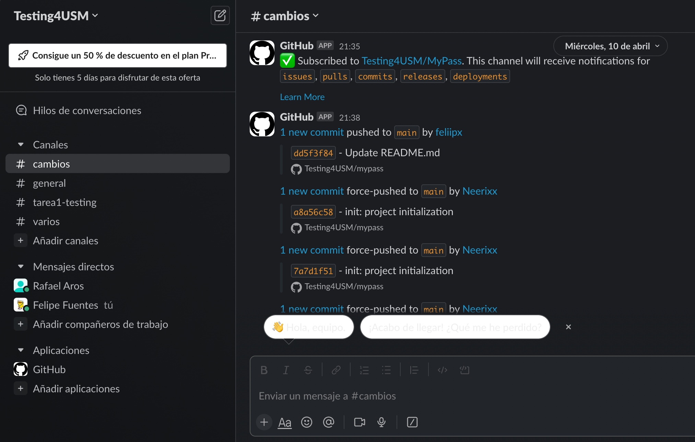
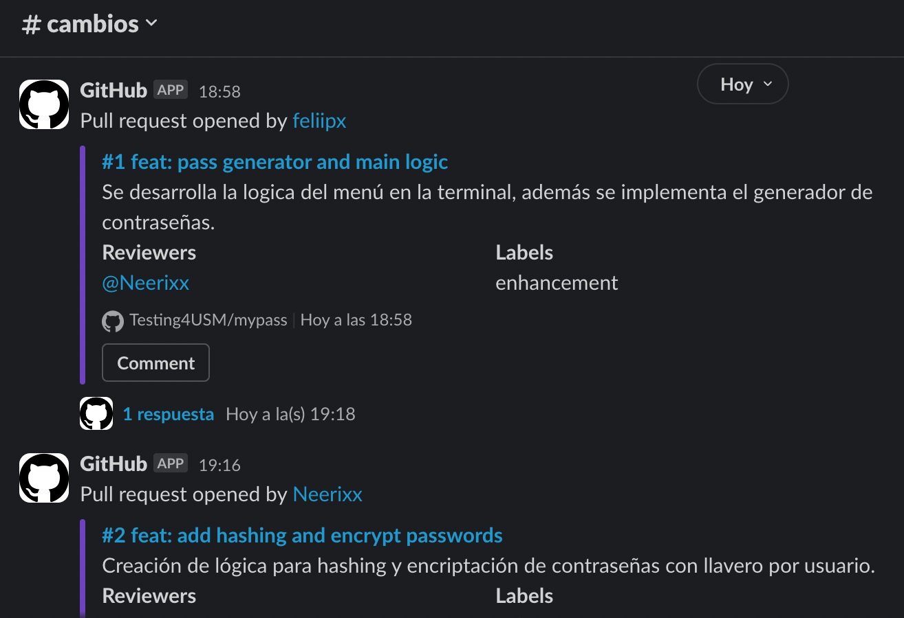

## Integrantes grupo 4:

- Rafael Aros (201973034-7)  
- Felipe Fuentes (201973102-5)

## Validación 

Como el requerimiento de la tarea no está completo del todo, se establecen requerimientos extra para un mejor desarrollo del programa.

### Requerimientos extra

1. El largo mínimo de la contraseña creada con el generador será de 8 caracteres.
2. El largo máximo de la contraseña creada con el generador será de 16 caracteres.
3. El almacenamiento seguro será en una base de datos (SQLite).
4. Se tiene una cuenta para acceder al programa de manera segura.

Los límites de las contraseñas fueron considerados por la información del siguiente link: https://www.linkedin.com/pulse/2020-8-character-password-good-enough-colin-yeung/

## Verificación
¿Cómo asegurarías que el programa cumpla el requerimiento?

#### Respuesta:
A través de las respectivas pruebas para los distintos requerimientos que se solicitan, además de los agregados por nosotros. 

## Organización del proyecto
Escogimos python para trabajar ya que era lo más simple de desarrollar y luego realizar pruebas.

Trabajamos en conjunto comunicandonos por Discord, utilizando Git y Slack para el almacenamiento y registro de archivos.

La separación de tareas fue la siguiente:
- Felipe: Creación del main, generador de contraseñas, README.
- Rafael: Base de datos, logs, tests.

## Evidencia flujo de trabajo
Como se solicitó, el proyecto se realizó con la integración de Git en Slack.

## Problemas encontrados
Como tenemos dominio de Python y de bases de datos, en particular no tuvimos problemas.
Destacar que las pruebas se definieron en conjunto porque en esa parte no teníamos tanta experiencia.

